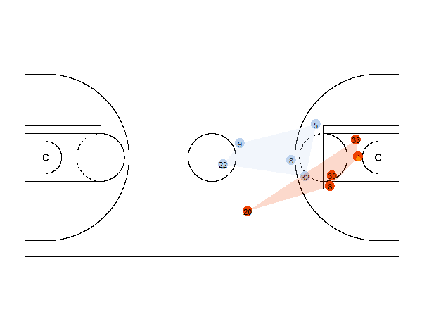
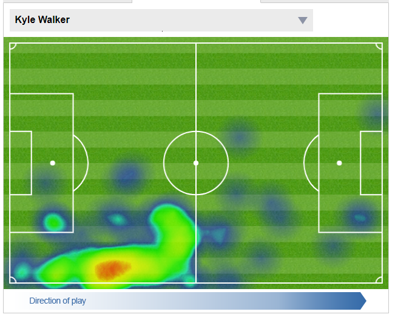

```{r setup, include=FALSE}
options(htmltools.dir.version = FALSE)
```

## Today's agenda

* "Big data" and streaming data

* Analytics in basketball

* Case study: NBA shot charts

* Player movement analytics and "heat mapping"

* Case study: tennis analytics with heat maps

---

## "Big data" 

<iframe width="100%" height="450px" frameBorder="0" src="https://a.tiles.mapbox.com/v4/enf.c3a2de35.html?access_token=pk.eyJ1IjoiZW5mIiwiYSI6IkNJek92bnMifQ.xn2_Uj9RkYTGRuCGg4DXZQ"></iframe><figcaption>Map by Eric Fischer, Mapbox</figcaption>

---

## "Big data" 

<iframe width="700" height="400" src="https://www.youtube.com/embed/avP5d16wEp0" frameborder="0" allowfullscreen></iframe>


---

## Big data architecture


---

## Big data and the cloud


.footnote[Source: [BSD Magazine](https://bsdmag.org/neybsd_aws/)]

---

## Streaming data


.footnote[Source: [InfoWorld](https://www.infoworld.com/article/2948952/big-data/streaming-analytics-enter-the-fast-lane.html)]

---

## In-game tracking


.footnote[Source: [BBC](http://www.bbc.com/news/business-40636746)]

---

## In-game tracking

<iframe width="560" height="315" src="https://www.youtube.com/embed/avVMb_FZmZI?rel=0" frameborder="0" allow="autoplay; encrypted-media" allowfullscreen></iframe>

---
class: middle, center, inverse

## Analytics in basketball

---

## Analytics in basketball

* Adam Silver, NBA commissioner ([source](http://knowledge.wharton.upenn.edu/article/nbas-adam-silver-analytics-transforming-basketball/)): 

> Analytics are part and parcel of virtually everything we do now.  

* Applications: in-game analytics, scouting, rest analytics, business analytics


---

## Analytics in basketball

<iframe src="http://vplayer.nbcsports.com/p/BxmELC/newengland_embed/select/media/e4CxIzmuaPXy" width="624" height="351" frameborder="0" allowfullscreen>Your browser does not support iframes.</iframe>

---

## Analytics in basketball

<iframe width="560" height="315" src="https://www.youtube.com/embed/NZf9NFaCQHQ?rel=0" frameborder="0" allow="autoplay; encrypted-media" allowfullscreen></iframe>

---
class: middle, center, inverse

## Discussion: analytics in basketball

---

## Analytics in basketball: the "hot hand"

<iframe src="https://giphy.com/embed/AGi1NTmrNu4py" width="480" height="235" frameBorder="0" class="giphy-embed" allowFullScreen></iframe><p><a href="https://giphy.com/gifs/nba-finals-AGi1NTmrNu4py">via GIPHY</a></p>

---

class: middle, center, inverse

## Case study: basketball shot charts

---

## Application programming interfaces (APIs)

* API (general definition): the way in which you can access a particular software application programmatically

* __Data API__: interface that allows you to access data programmatically
    * Often: requests are made via URL; interact with data via URL parameters

---

## The NBA stats API

* (Largely) undocumented interface to the NBA's stats catalog

* Example URL (Karl-Anthony Towns): http://stats.nba.com/stats/playergamelog/?PlayerId=1626157
&Season=2017-18&SeasonType=Regular+Season&LeagueId=00

---

## Basketball shot charts


.footnote[Source: ESPN.com/Grantland/Kirk Goldsberry]

---

## Applications of shot charts


.footnote[Source: [Grantland/Kirk Goldsberry](http://grantland.com/features/department-of-defense/)]

---

## Applications of shot charts

<script async src="//player-backend.cnevids.com/script/video/546a4d2f61646d083a140000.js?iu=/3379/conde.wired/partner"></script>

---
class: middle, center, inverse

## Player movement analytics

---

## Player movement analytics



.footnote[Source: [James Curley, UT Austin](http://curleylab.psych.columbia.edu/nba.html)]

---

## "Heat" maps


.footnote[Source: [Technical.ly](https://technical.ly/philly/2012/11/20/philadelphia-police-gis-new-system-crime-tracking/)]

---

## Player "heat" maps



.footnote[Source: [Daily Mail](http://www.dailymail.co.uk/sport/football/premier-league/fixtures.html#s2017-m919164)]

---
class: middle, center, inverse

## Case study: Game tracking and tennis analytics

---

## Tennis analytics


.footnote[[Analytics examples from Hawkeye](https://www.hawkeyeinnovations.com/sports/tennis)]

---

## Tennis analytics

<iframe width="560" height="315" src="https://www.youtube.com/embed/sBbUyUC01Ds?rel=0" frameborder="0" allow="autoplay; encrypted-media" allowfullscreen></iframe>

---
class: middle, center, inverse

## Summary discussion: the value of analytics in sports

---
class: middle, center, inverse

## Next up: Sports data visualization and sports data journalism


<style>

body {
  font-family: Verdana; 
}

h1, h2, h3 {
  color: #840000; 
  font-family: Verdana;
  font-weight: bold; 
}

a {
  color: #ff0000; 
}

.inverse {
  background-color: #840000; 

}
</style>


