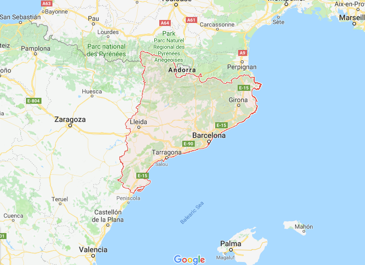
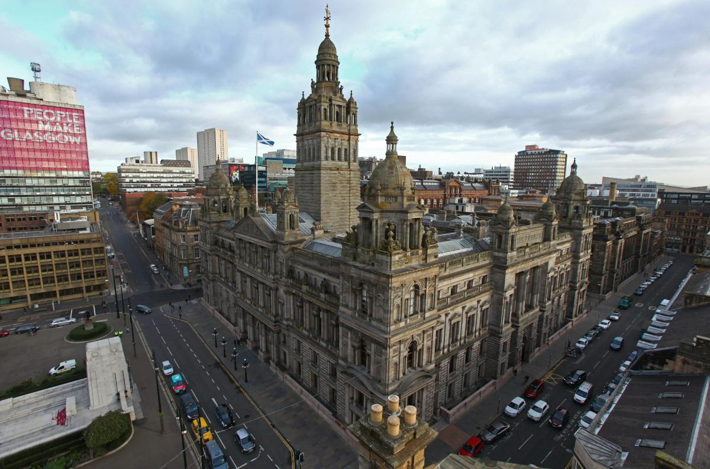

```{r setup, include=FALSE}
options(htmltools.dir.version = FALSE)
```

## Today's agenda

* Nationalism, nations, and states

* Politics and political economy

* Political economy and sport in the 20th century

* Case study: FC Barcelona and Catalonia

* Case study: Celtic, Rangers, and the "Old Firm" rivalry

---
class: middle, center, inverse

## Nations, states, and identity

---

## The "nation" 


.footnote[Source: [InteriorDecorating.com](https://www.interiordecorating.com/429236-1156-Oregon-State-Beaver-Nation-Starter-Rug-20x30)]

---

## The "state"

* World atlas example: http://walkerke.github.io/atlas/

---

## The nation-state

<center></center>

<span class="footnote">Source: [Eurominority](http://www.eurominority.eu/version/maps/map-nations.asp)</span>

---
class: middle, center, inverse

## _Imagined communities_

---
class: middle, center, inverse

## Discussion: how does sport relate to national identity?

---

## National identity and sport


.footnote[Source: [Houston Chronicle](https://www.chron.com/sports/dynamo/article/U-S-women-s-soccer-team-caps-two-game-sweep-of-12816531.php)]

---

## Migration, diaspora, and identity

* Example: Giannis Antetokounmpo in [Toronto](http://www.pappaspost.com/video-torontos-big-fat-greek-welcome-giannis-antetokounmpo/) and [New York City](http://www.nba.com/bucks/video/teams/bucks/2018/02/07/1910910/1517991537992-gagreekmeetnyc-1910910)

---

## Sport and colonialism


.footnote[Source: [The Sports Mirror](http://www.thesportsmirror.com/2015/02/cricket-world-cup-2015-group-preview-india-and-south-africa-should-be-the-top-two-in-group-b/)]

---
class: middle, center, inverse

## Political economy

---

## Ideology and political economy

Major traditions in the 20th century: 

* Ideology: __liberalism__, __socialism__, __nationalism__

* Political-economic frameworks: __capitalism__, __communism__, __fascism__

---

## Sport and fascism in Nazi Germany


.footnote[Source: [ABC.net.au](http://www.abc.net.au/news/2016-07-21/from-hitler-to-superpower-boycotts-threats-to-the-olympics/7649004)]

---

## Sport and the Cold War


.footnote[Source: [Boston University](http://blogs.bu.edu/guidedhistory/russia-and-its-empires/ian-blau/)]

---

## Sport and the Cold War

<iframe src="https://abcnews.go.com/video/embed?id=29141374" width="640" height="360" scrolling="no" style="border:none;" allowfullscreen></iframe>

---
class: middle, center, inverse

## Case study: Catalonia and FC Barcelona

---

## Catalonia



---

## Economics of Spain 


.footnote[Source: [AIS Group](https://www.ais-int.com/las-familias-vascas-las-que-mas-dinero-ingresan-en-espana/)]

---

## FC Barcelona


.footnote[Source: [barcelonas.com](https://www.barcelonas.com/fc-barcelona-logo.html)]

---

## General Franco and Real Madrid


.footnote[Source: [panenka.org](http://www.panenka.org/miradas/cuatro-decadas-de-futbol-sin-franco/)]

---

## Barcelona: _mes que un club_

<iframe src="https://embed.theguardian.com/embed/video/football/video/2012/nov/22/fc-barcelona-catalonia-independence-video" width="700" height="525" frameborder="0" allowfullscreen></iframe>

---
class: middle, center, inverse

## Discussion: FC Barcelona and Catalan independence

---
class: middle, center, inverse

## Case study: The Old Firm

---

## Glasgow



.footnote[Source: [Evening Times](http://www.eveningtimes.co.uk/news/15701821.Families_wanted_to_breathe_new_life_into_Glasgow_city_centre_expansion_plans/)]

---

## Religion in Northern Ireland


<span class="footnote">Source: [New Maps of Ulster](http://newmapsofulster.blogspot.com/2013_02_01_archive.html)</span>

---

## The "Troubles"


.footnote[Source: [Commentary Magazine](https://www.commentarymagazine.com/foreign-policy/europe/northern-ireland-troubles-revisited/)]

---

## Nationalism and the Old Firm


<span class="footnote">Source: [BBC](http://www.bbc.co.uk/news/uk-scotland-13438080)</span>

---

## Glasgow and the Old Firm

<iframe width="700" height="500" src="https://www.youtube.com/embed/cggTbCcbcNA?rel=0&amp;start=142" frameborder="0" allow="autoplay; encrypted-media" allowfullscreen></iframe>

---
class: middle, center, inverse

## Discussion: religion, politics, networks, & sport

---

class: middle, center, inverse

## Next up: Sports and race


<style>

body {
  font-family: Verdana; 
}

h1, h2, h3 {
  color: #840000; 
  font-family: Verdana;
  font-weight: bold; 
}

a {
  color: #ff0000; 
}

.inverse {
  background-color: #840000; 

}
</style>


