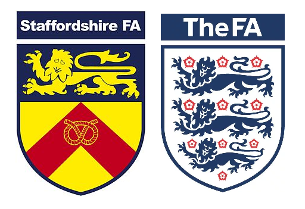

```{r setup, include=FALSE}
options(htmltools.dir.version = FALSE)
```

## Today's agenda

* Introduction to spatial theory

* Territory, place, scale, networks (TPSN)

* Case study: the "South" and SEC football

* Case study: Sports and rural America

---
class: middle, center, inverse

## Discussion: how are sports related to places?  

---

## Spatial theory

* __Social theory__: the application of theoretical frameworks to understand and interpret social phenomena

* __Spatial theory__: The use of theoretical frameworks to understand how social phenomena operate with regards to geography, space, and places

---

## The "production of space"

* _La production de l'espace_ by Henri Lefebvre (French sociologist)

* Core ideas:
    * Space is a _social product_
    * _Every society_ produces their own "spaces"

---

## _Absolute_ and _Relational_ space

Key distinctions in spatial theory: 

* _Absolute space_: space as physical, material reality

* _Relational space_: space existing _relative_ to a particular social & temporal context

---
class: middle, center, inverse

## The TPSN theoretical framework

---

## The "TPSN" framework

* Framework used to _theorize sociospatial relations_

* Components: 

    * _Territory_
    
    * _Place_
    
    * _Scale_
    
    * _Networks_

---
class: middle, center, inverse

## Territory

---

## Territory and sport


.footnote[Source: [CityPages](http://www.citypages.com/news/twins-territory-stretches-into-wisconsin-according-to-baseball-fandom-map-6537215)]

---

## Sports "territories"

* MLB Baseball: https://www.nytimes.com/interactive/2014/04/24/upshot/facebook-baseball-map.html

* NCAA (FBS) football: https://www.nytimes.com/interactive/2014/10/03/upshot/ncaa-football-map.html

---
class: middle, center, inverse

## Place

---

## Sport and place identity


.footnote[Source: [NYC Parks](https://www.nycgovparks.org/parks/alexander-hamilton-playground/facilities/basketball)]

---

## Sport and place identity


.footnote[Source: [ActiveRain](https://activerain.com/blogsview/1923491/dominion-valley--a-stunning---sophisticated-gated--golf-course-community-in-haymarket--va)]

---

## Sport and place identity


.footnote[Source: [NEO Sports Insiders](http://www.neosportsinsiders.com/suburban-league-baseball-standings-april-24/)]

---
class: middle, center, inverse

## Scale

---

## Scale and sport



---
class: middle, center, inverse

## Networks

---

## Networks and sports fandom


.footnote[Source: [SteelersBars.com](http://www.steelersbars.com/texas/woodys-tavern/)]

---
class: middle, center, inverse

## Case study: The "South"

---
class: middle, center, inverse

## Discuss: what makes the South distinctive?  

---
class: middle, center, inverse

## Territory and "the South"

---

## "SEC Country"


.footnote[Source: [Belmont Icehouse](https://belmonticehouse.com/portfolio/texas-am/)]

---

## Football and Southern pride


.footnote[Source: [Grantland](http://grantland.com/features/s-e-c-s-e-c-s-e-c/)]

---

## Southern cultural symbols


.footnote[Source: [ESPN.com](http://www.espn.com/college-football/story/_/id/21067022/college-football-saturday-sec-country-waffle-house)]

---

## The South, football, and US history


.footnote[Source: [Sport in American History](https://ussporthistory.com/2015/06/29/confederate-iconography-and-southern-college-football/)]

---
class: middle, center, inverse

## Sports and rural America

---

## The "state of hockey"

<iframe width="700" height="525" src="https://www.youtube.com/embed/06SahcgU-Ig?rel=0" frameborder="0" allow="autoplay; encrypted-media" allowfullscreen></iframe>

---

## "Hoosiers"


.footnote[Source: [AOL.com](https://www.aol.com/2014/02/14/french-lick-indiana-a-visit-to-larry-birds-hometown/)]

---

## Friday Night Lights


.footnote[Source: [Bustle.com](https://www.bustle.com/articles/154953-7-books-for-friday-night-lights-fans-who-love-football-texas-and-tim-riggins)]

---

## Rural population change


.footnote[Source: [USDA ERS](https://www.ers.usda.gov/amber-waves/2017/september/rural-areas-show-overall-population-decline-and-shifting-regional-patterns-of-population-change/)]

---

## Schools, sports, and rural identity

<iframe width="700" height="525" src="https://www.youtube.com/embed/b24GVsz-4qE?rel=0" frameborder="0" allow="autoplay; encrypted-media" allowfullscreen></iframe>

---
class: middle, center, inverse

## Next up: Sports and nationalism


<style>

body {
  font-family: Roboto; 
}

h1, h2, h3 {
  color: #840000; 
  font-family: Roboto;
  font-weight: bold; 
}

a {
  color: #ff0000; 
}

.inverse {
  background-color: #840000; 

}
</style>


