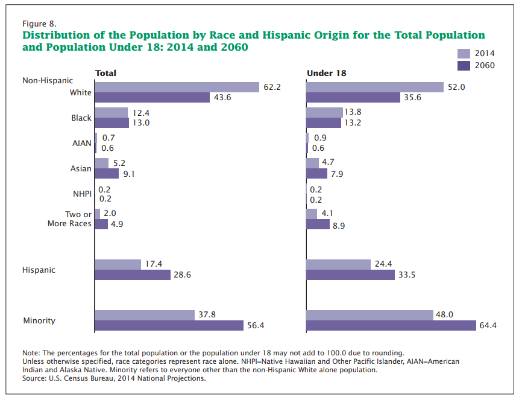
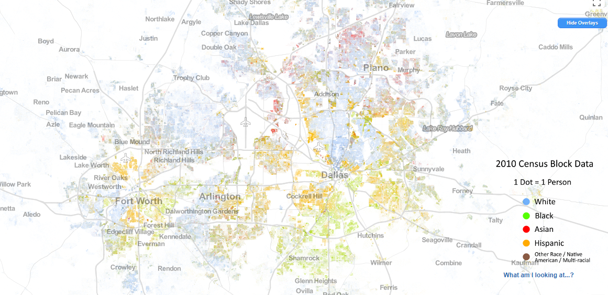
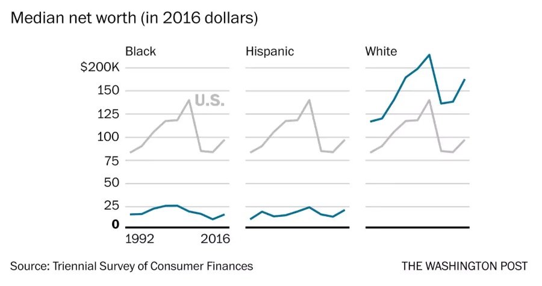
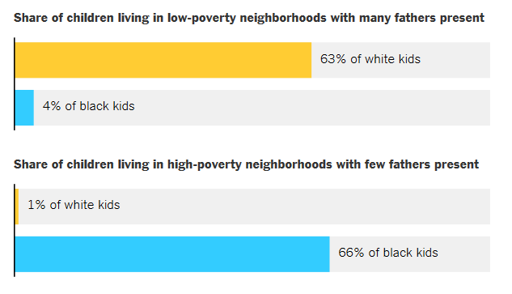
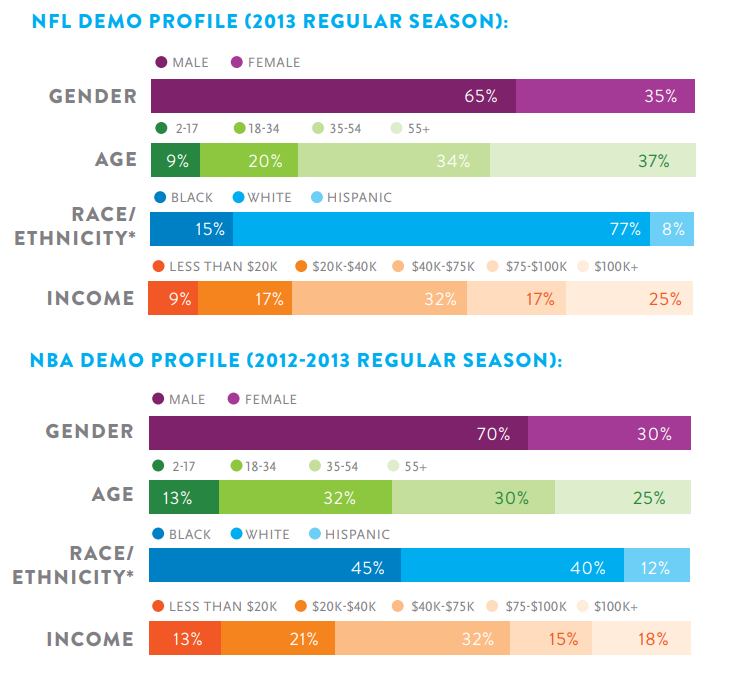
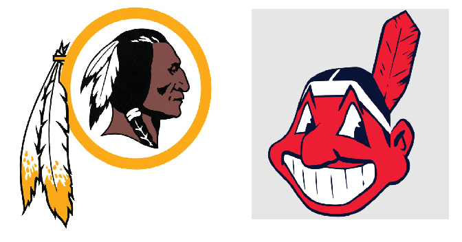
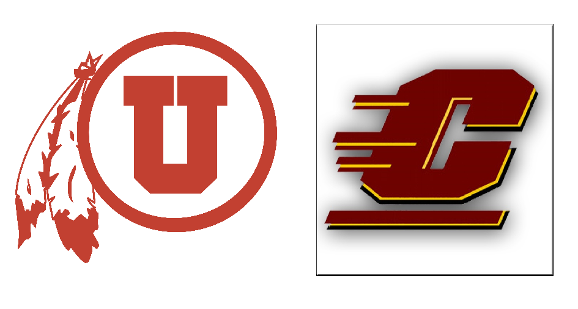

```{r setup, include=FALSE}
options(htmltools.dir.version = FALSE)
```

## Today's agenda

* Race and critical race theory

* Racial geographies of the US

* Racial politics and sport in the US and Europe

* Case study: Apartheid and sport in South Africa

* Case study: Native American mascots

---
class: middle, center, inverse

## Discussion: what is "race?"  

---

## Race

* _Phenotype_: observable characteristics (including skin color)

* _Race_: social category that may (or may not) relate to phenotype

---

## Race in global context

* Comparative racial categories around the world: http://www.understandingrace.org

---
class: middle, center, inverse

## Critical race theory

---

## Critical race theory

* Application of _critical social theory_ to studies of race and power

* Key component: _power relations_ within society

* Related: _whiteness_ studies

---

## Critical race theory

* _Individual_ racism: biases held by a person against others of a given race/racial background

* _Structural_ racism: systematic biases within a society that grant opportunities to people of a given racial background, and limit those of other backgrounds

---
class: middle, center, inverse

## Racial geographies of the US

---

## Race in the United States



.footnote[Source: [US Census Bureau](https://census.gov/content/dam/Census/library/publications/2015/demo/p25-1143.pdf)]

---

## Race in the United States



.footnote[Source: [UVA Demographics](https://demographics.virginia.edu/DotMap/index.html)]

---

## Racial inequality in the US



.footnote[Source: [The Washington Post](https://www.washingtonpost.com/news/wonk/wp/2017/09/28/black-and-hispanic-families-are-making-more-money-but-they-still-lag-far-behind-whites/?utm_term=.f46f6262dee3)]

---

## Racial inequality in the US



.footnote[Source: [The New York Times](https://www.nytimes.com/interactive/2018/03/19/upshot/race-class-white-and-black-men.html)]

---

## Race and professional sports in the US

* [Interactive breakdown of NFL, MLB, NBA, and MLS players](https://e.infogram.com/2012-Racial-Breakdown-of-Major-US-Professional-Sports?src=embed)

---

## Demographics of sports fans



.footnote[Source: [Nielsen](http://www.nielsen.com/us/en/insights/reports/2014/year-in-the-sports-media-report-2013.html)]

---

class: middle, center, inverse

## Race, politics, and sport

---

## Race, politics, and sport in the US

* [Video: Looking at Sports and Race in America - The New Yorker](https://www.newyorker.com/sections/video/looking-at-sports-and-race-in-america)

---

## Racism in European football


.footnote[Source: [NPR](https://www.npr.org/sections/codeswitch/2014/05/01/308408903/european-soccer-tackles-racism-but-slips-on-a-banana-peel)]

---

## _Les Bleus_ - _black, blanc, et beur_


.footnote[Source: Reuters]

---

## Race and "The Greek Freak"


.footnote[Source: [The New York Times](https://www.nytimes.com/2019/05/03/sports/giannis-antetokounmpo-greece.html)]

---
class: middle, center, inverse

## Case study: apartheid and sport in South Africa

---

## Apartheid in South Africa


<span class="footnote">[Source](http://africanhistory.about.com/od/apartheid/ig/Apartheid-Signs-Image-Gallery/)</span>

---

## Legacy of apartheid

* [Map of racial segregation in South Africa](http://dotmap.adrianfrith.com/)

---

## Apartheid and international sport


.footnote[Source: [Vice Sports](https://www.vice.com/en_au/article/3dgpb3/the-sports-teams-who-defied-the-apartheid-boycott-of-south-africa)]

---

## Apartheid and sport in South Africa

<iframe width="560" height="315" src="https://www.youtube.com/embed/LBCH1GiIYIQ" frameborder="0" allow="accelerometer; autoplay; encrypted-media; gyroscope; picture-in-picture" allowfullscreen></iframe>

---
class: middle, center, inverse

## Case study: Native American mascots in the US

---

## Native American mascots and US sports teams



---

## Native American mascots and US sports teams



.footnote[[Central Michigan guidelines on face paint and game behavior](https://www.cmich.edu/ourcmu/Pages/honor-the-chippewa-name.aspx)]

---

## Mascot changes


---

## Native American mascots

* [Video: selections from _More Than a Word_](http://tcu.kanopy.com/video/more-word)

---
class: middle, center, inverse

## Discussion: what makes a mascot offensive?  

---

class: middle, center, inverse

## Next up: Sports, gender, & sexuality


<style>

body {
  font-family: Verdana; 
}

h1, h2, h3 {
  color: #840000; 
  font-family: Verdana;
  font-weight: bold; 
}

a {
  color: #ff0000; 
}

.inverse {
  background-color: #840000; 

}
</style>


