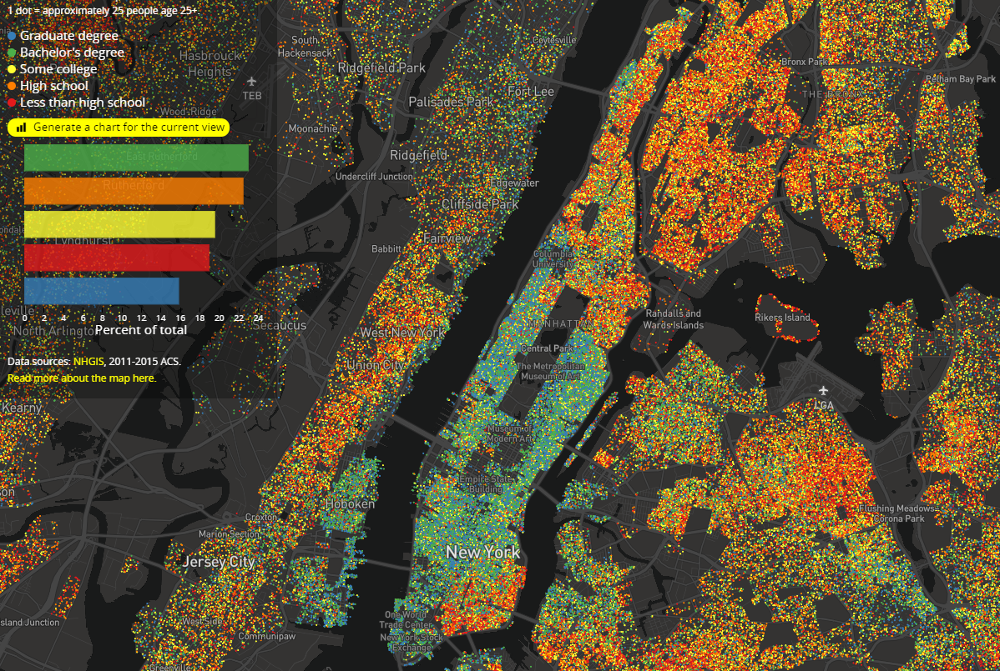
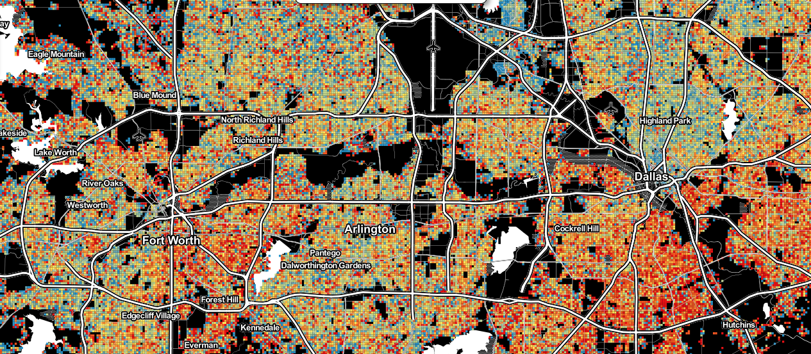
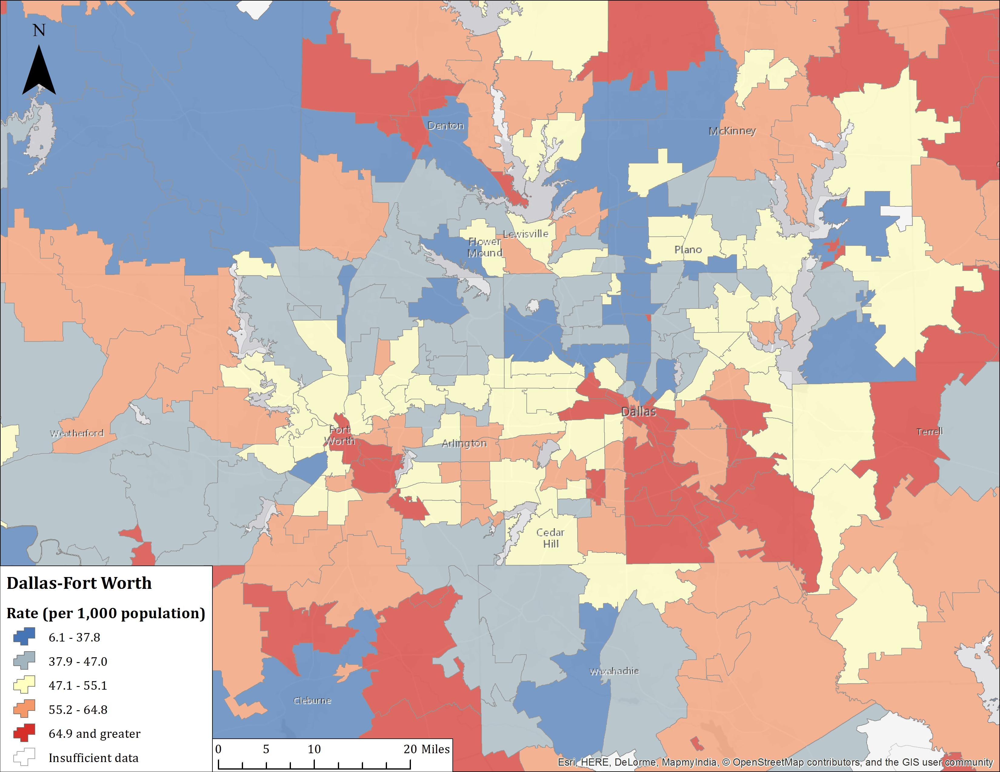
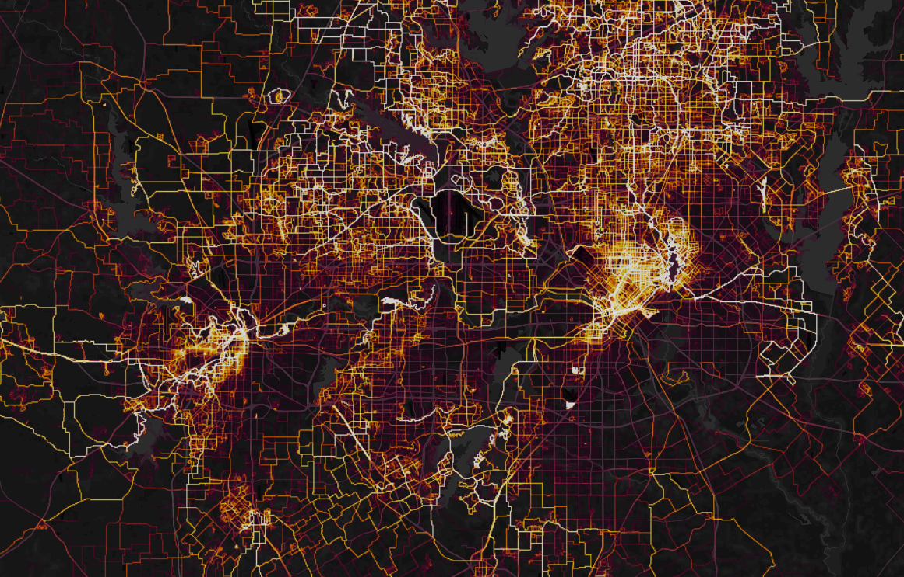
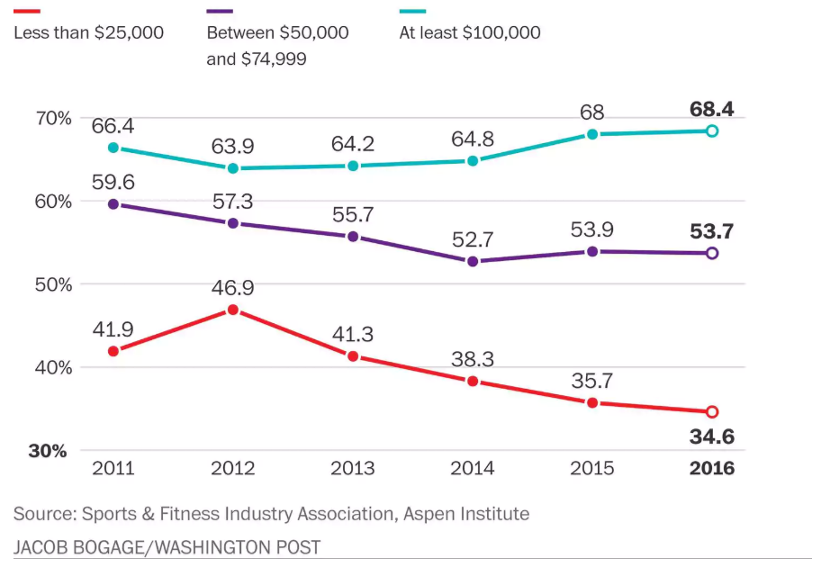

```{r setup, include=FALSE}
options(htmltools.dir.version = FALSE)
```

## Today's agenda

* Recreation and leisure

* Economic inequality in cities

* Case study: recreation, obesity, and economic inequality

* Youth sports

* Case study: economic inequality and youth sports participation

---
class: middle, center, inverse

## Recreation and leisure

---

## Leisure in the United States


.footnote[Source: [BLS](https://www.bls.gov/TUS/CHARTS/LEISURE.HTM)]

---

## Sports as leisure activity


.footnote[Source: [D Magazine](https://www.dmagazine.com/publications/d-ceo/2014/november/the-most-exclusive-private-dallas-clubs/)]

---

## Exercise in the United States

* Chart gallery from BLS: https://www.bls.gov/spotlight/2017/sports-and-exercise/home.htm

---

## When we exercise


.footnote[Source: [Henrik Lindberg](https://flowingdata.com/2017/07/12/peak-times-for-leisure-and-sports/)]

---

class: middle, center, inverse

## Economic inequality and health outcomes in cities

---

## Economic inequality in cities


DFW: $21,312 (20th) vs. $235,120 (95th)

.footnote[Source: [Axios.com/Brookings](https://www.axios.com/where-income-inequality-is-most-severe-558a6d35-ae4a-4d18-b3bc-643433abb43f.html)]

---

## Socioeconomic disparities, mapped 



.footnote[Source: [Educational Attainment in America](http://personal.tcu.edu/kylewalker/maps/education/index.html#11.26/40.7967/-73.9132)]

---

## Concentrated poverty

* [Interactive maps: Brookings Institution](https://www.brookings.edu/research/u-s-concentrated-poverty-in-the-wake-of-the-great-recession/)

---

## Geographies of obesity



.footnote[Source: [RTI International](http://synthpopviewer.rti.org/obesity/viewer.html)]

---

## Geographies of heart disease



---
class: middle, center, inverse

## Case study: recreation, obesity, and social inequality

---

## SoulCycle


.footnote[Source: [Vox.com](https://www.vox.com/science-and-health/2017/1/4/13982272/exercise-inequality-luxury-gyms-cheap-workout-spaces)]

---

## Strava activity



.footnote[Source: [Strava.com](https://www.strava.com/heatmap#10.32/-97.18765/32.80216/hot/all)]

---

## Income and exercise


.footnote[Source: [Vox.com](https://www.vox.com/science-and-health/2017/1/4/13982272/exercise-inequality-luxury-gyms-cheap-workout-spaces)]

---

## Education and exercise


.footnote[Source: [BLS/ATUS](https://www.bls.gov/spotlight/2017/sports-and-exercise/home.htm)]

---
class: middle, center, inverse

## Maps: socioeconomic status and health outcomes

---

## Obesity in poor neighborhoods

<iframe width="560" height="315" src="https://www.youtube.com/embed/7MJnm5X9NN0?rel=0&amp;start=550" frameborder="0" allow="autoplay; encrypted-media" allowfullscreen></iframe>

---
class: middle, center, inverse

## Discussion: the linked geography of wealth and health inequality

---
class: middle, center, inverse

## Youth sports

---

## Youth sports


---

## Youth sports


---

## Youth sports


---
class: middle, center, inverse

## Discussion: what does youth sports mean to you?  

---

## Youth sports statistics


.footnote[Source: [Washington Post](https://www.washingtonpost.com/news/recruiting-insider/wp/2017/09/06/youth-sports-study-declining-participation-rising-costs-and-unqualified-coaches/?utm_term=.3aa08068a128)]

---
class: middle, center, inverse

## Case study: economic inequality and youth sports

---

## Youth sports participation by income



.footnote[Source: [Washington Post](https://www.washingtonpost.com/news/recruiting-insider/wp/2017/09/06/youth-sports-study-declining-participation-rising-costs-and-unqualified-coaches/?utm_term=.3aa08068a128)]

---

## The cost of youth sports

<iframe src="https://abcnews.go.com/video/embed?id=49553968" width="640" height="360" scrolling="no" style="border:none;" allowfullscreen></iframe>

---

## Youth sports programs: MLB

* [Video: MLB Urban Youth Academy program](https://www.foxsports.com/southwest/video/730795587996)

---
class: middle, center, inverse

## Discussion: inequality and youth sports

---

class: middle, center, inverse

## Next up: Sports analytics I


<style>

body {
  font-family: Verdana; 
}

h1, h2, h3 {
  color: #840000; 
  font-family: Verdana;
  font-weight: bold; 
}

a {
  color: #ff0000; 
}

.inverse {
  background-color: #840000; 

}
</style>


